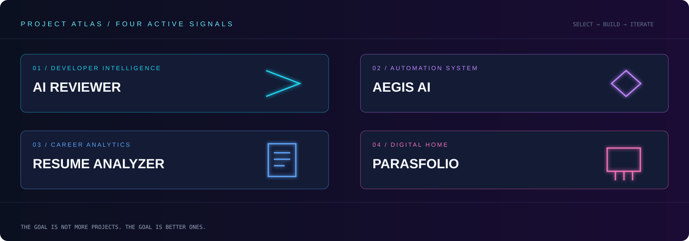

<div align="center">
  
</div>

<br/>

<div align="center">

**I turn raw data and rough ideas into software people can use.**

<sub>Machine Learning · Data Science · Application Development</sub>

<br/><br/>

<a href="https://parasfolio.qd.je/"><b>↗ Portfolio</b></a>&nbsp;&nbsp;&nbsp;·&nbsp;&nbsp;&nbsp;
<a href="mailto:parasbishnoi012@gmail.com"><b>✉ Email</b></a>&nbsp;&nbsp;&nbsp;·&nbsp;&nbsp;&nbsp;
<a href="https://www.linkedin.com/in/paras029"><b>in LinkedIn</b></a>&nbsp;&nbsp;&nbsp;·&nbsp;&nbsp;&nbsp;
<a href="https://x.com/parasbishnoi03"><b>𝕏 X</b></a>

</div>

<br/>

```text
╭──────────────────────────────────────────────────────────────────────╮
│  NOW                                                                  │
│  Building  →  useful AI tools and data-driven applications            │
│  Learning  →  Python · Kotlin · cloud engineering                     │
│  Exploring →  ML pipelines · visualisation · practical automation     │
╰──────────────────────────────────────────────────────────────────────╯
```

## Selected systems



<table>
  <tr>
    <td width="50%" valign="top">
      <h3>01 / AI Reviewer</h3>
      <p>AI-assisted code review built to make developer feedback more useful.</p>
      <a href="https://github.com/parasbishnoi029/AI-Reviewer"><b>Explore repository ↗</b></a>
    </td>
    <td width="50%" valign="top">
      <h3>02 / Aegis AI</h3>
      <p>An experiment in intelligent workflows and practical automation.</p>
      <a href="https://github.com/parasbishnoi029/Aegis-AI"><b>Explore repository ↗</b></a>
    </td>
  </tr>
  <tr>
    <td width="50%" valign="top">
      <h3>03 / AI Resume Analyzer</h3>
      <p>Turns a static resume into direct, actionable feedback.</p>
      <a href="https://github.com/parasbishnoi029/AI-Resume-Analyzer"><b>Explore repository ↗</b></a>
    </td>
    <td width="50%" valign="top">
      <h3>04 / Parasfolio</h3>
      <p>A home for my projects, experiments, and work in progress.</p>
      <a href="https://parasfolio.qd.je/"><b>Visit site ↗</b></a>
    </td>
  </tr>
</table>

## Engineering orbit



<div align="center">

`Python` · `Kotlin` · `MySQL` · `FastAPI` · `Firebase` · `Supabase` · `Google Cloud` · `Cloudflare` · `Vercel`

`NumPy` · `Pandas` · `Matplotlib` · `Plotly` · `PyTorch` · `TensorFlow` · `OpenCV`

</div>

## The operating principle

> **A project should answer one question clearly:** who does this help, and what gets easier because it exists?

That is why I am drawn to ML, data, and applications. The interesting part is not the buzzword. It is using technology to make a real decision, task, or workflow better.

<br/>

<div align="center">
  <a href="https://www.instagram.com/parasbishnoi.03/">Instagram</a>
  &nbsp;·&nbsp;
  <a href="https://www.facebook.com/paras.bishnoi.29">Facebook</a>
  &nbsp;·&nbsp;
  <a href="https://github.com/parasbishnoi029?tab=repositories">All repositories</a>
  <br/><br/>
  <sub>PARAS BISHNOI / BUILDING WITH CURIOSITY AND INTENT</sub>
</div>
