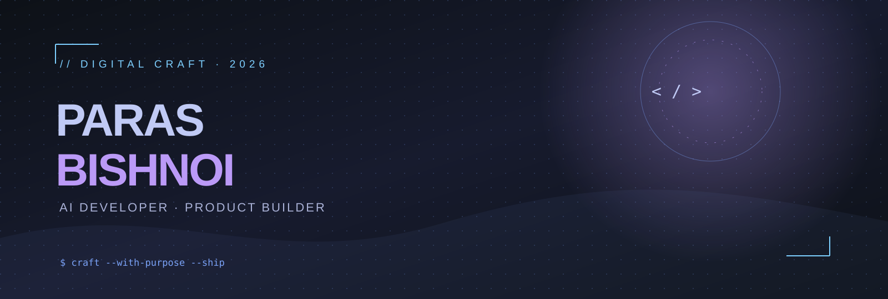

<div align="center">
  

  <br />
  <a href="https://github.com/parasbishnoi029?tab=followers"></a>
  <a href="https://github.com/parasbishnoi029"></a>
</div>

<br />

```text
> booting /parasbishnoi029 ...
  role       Full-stack & AI developer
  mission    Turn difficult problems into useful products.
  now        Building, learning, shipping.
```

## ◈ Command Center

| Signal | Current status |
| :-- | :-- |
| Focus | Applied AI, developer tools, and full-stack products |
| Building | Reliable software with useful, human-first interfaces |
| Learning | LLM engineering, MLOps, and scalable systems |
| Open to | Collaboration, meaningful open source, and interesting problems |

## ◈ Featured Projects

<table>
  <tr>
    <td width="50%" valign="top">
      <h3>🤖 AI Reviewer</h3>
      <p>AI-assisted code review built to surface issues and improve developer feedback loops.</p>
      <p><a href="https://github.com/parasbishnoi029/AI-Reviewer">Repository →</a></p>
    </td>
    <td width="50%" valign="top">
      <h3>🛡️ Aegis AI</h3>
      <p>An AI product focused on practical intelligence, automation, and a cleaner user experience.</p>
      <p><a href="https://github.com/parasbishnoi029/Aegis-AI">Repository →</a></p>
    </td>
  </tr>
  <tr>
    <td width="50%" valign="top">
      <h3>📄 AI Resume Analyzer</h3>
      <p>Resume analysis tooling that turns static documents into actionable feedback.</p>
      <p><a href="https://github.com/parasbishnoi029/AI-Resume-Analyzer">Repository →</a></p>
    </td>
    <td width="50%" valign="top">
      <h3>🌐 Parasfolio</h3>
      <p>A portfolio built to present projects, skills, and work without the usual clutter.</p>
      <p><a href="https://github.com/parasbishnoi029/Parasfolio">Repository →</a></p>
    </td>
  </tr>
</table>

> **Reality check:** confirm the four repository slugs above before pushing. GitHub profile READMEs cannot reliably fetch arbitrary repository metadata by themselves; the links are intentionally simple and durable.

## ◈ GitHub Telemetry

<div align="center">
  
  
  <br />
  
</div>

<div align="center">
  
  
  
</div>

<div align="center">
  
</div>

### Contribution flow


<!-- Snake output is generated by .github/workflows/snake.yml after the first successful run. -->
<div align="center">
  
</div>

## ◈ Stack, without badge landfill

| Domain | Tools I use or am actively deepening |
| :-- | :-- |
| **AI / ML** | Python, LLM APIs, prompt engineering, data analysis |
| **Frontend** | React, Next.js, JavaScript, TypeScript, HTML, CSS |
| **Backend** | Node.js, Express, REST APIs, Python |
| **Data** | MongoDB, PostgreSQL, MySQL, Firebase |
| **Cloud / DevOps** | Git, GitHub Actions, Docker, Vercel, Linux |
| **Design / workflow** | Figma, Postman, VS Code |

## ◈ Coding Metrics

<!--START_SECTION:waka-->
```text
WakaTime is not connected yet.
Follow SETUP.md to enable automatic weekly coding metrics.
```
<!--END_SECTION:waka-->

## ◈ Connect

<div align="center">
  <a href="https://github.com/parasbishnoi029"></a>
  <!-- Replace the placeholders below with real links before publishing. -->
  <a href="mailto:YOUR_EMAIL"></a>
  <a href="https://www.linkedin.com/in/YOUR_LINKEDIN"></a>
</div>

<div align="center">
  <sub>Built with intent. Maintained with curiosity. No empty hype.</sub>
</div>
