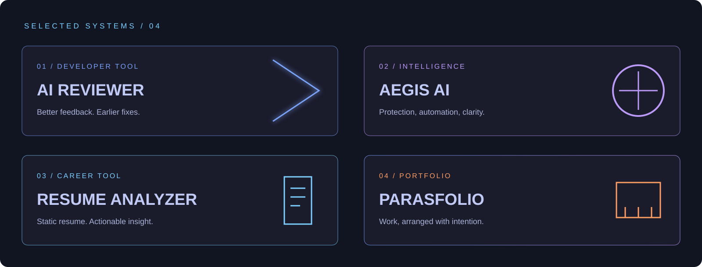

<div align="center">
  
</div>

<br/>

<div align="center">

# PARAS BISHNOI

### SOFTWARE DEVELOPER · ML & DATA ENTHUSIAST

<sub>Designing useful systems from data, code, and stubborn curiosity.</sub>

<br/><br/>

<a href="https://parasfolio.qd.je/"></a>
<a href="mailto:parasbishnoi012@gmail.com"></a>

</div>

<br/>

```text
╭──────────────────  SYSTEM STATUS  ──────────────────╮
│  FOCUS       Machine Learning · Data Science · Apps │
│  BUILDING    Projects that solve real problems      │
│  LEARNING    Python · Kotlin · Cloud tooling        │
│  OPERATING   Coffee → Code → Iterate                │
╰─────────────────────────────────────────────────────╯
```

## / MANIFESTO

I am a software developer interested in the useful edge of machine learning: data pipelines, visualisation, and applications that people can actually work with. I care about getting the fundamentals right before adding noise.

> **Current question:** How do you turn data into something people can understand and act on?

<br/>

## / PROJECT ARCHIVE



<table>
  <tr>
    <td width="50%"><h3>01 — AI Reviewer</h3><p>AI-assisted code review for clearer feedback and faster fixes.</p><a href="https://github.com/parasbishnoi029/AI-Reviewer">OPEN PROJECT ↗</a></td>
    <td width="50%"><h3>02 — Aegis AI</h3><p>An exploration of intelligent automation and practical workflows.</p><a href="https://github.com/parasbishnoi029/Aegis-AI">OPEN PROJECT ↗</a></td>
  </tr>
  <tr>
    <td width="50%"><h3>03 — AI Resume Analyzer</h3><p>Turns resumes into clear, actionable feedback.</p><a href="https://github.com/parasbishnoi029/AI-Resume-Analyzer">OPEN PROJECT ↗</a></td>
    <td width="50%"><h3>04 — Parasfolio</h3><p>My portfolio: work, experiments, and the things I am building.</p><a href="https://parasfolio.qd.je/">VISIT SITE ↗</a></td>
  </tr>
</table>

<sub>Check the repository URLs before publishing. A profile that points to missing work is not premium; it is unfinished.</sub>

<br/><br/>

## / TOOLCHAIN

<div align="center">


<br/><br/>

`NumPy` · `Pandas` · `Matplotlib` · `Plotly` · `PyTorch` · `TensorFlow` · `OpenCV` · `Machine Learning` · `Data Visualisation`

</div>

<br/>

## / LIVE SIGNAL

<div align="center">
  
</div>

<br/>


<!--
  After .github/workflows/contributions-3d.yml finishes once, uncomment this:
  
-->

<br/>

## / TRANSMISSIONS

<div align="center">
  <a href="https://www.linkedin.com/in/paras029"></a>
  <a href="https://x.com/parasbishnoi03"></a>
  <a href="https://www.instagram.com/parasbishnoi.03/"></a>
  <a href="https://www.facebook.com/paras.bishnoi.29"></a>
</div>

<br/>

<div align="center">
  
  <br/><br/>
  <sub>Made in India · Building in public · One useful system at a time</sub>
</div>
