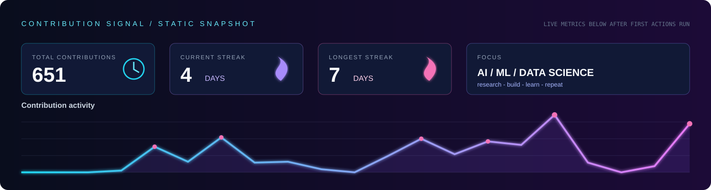
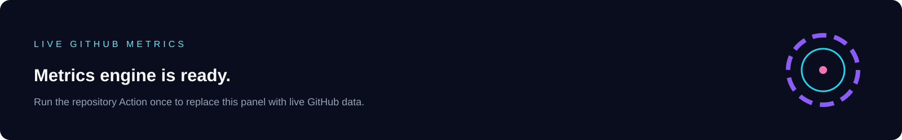

<div align="center">
  
  <br/><br/>
  <b>Turning raw data into intelligent systems people can use.</b>
  <br/>
  <sub>ARTIFICIAL INTELLIGENCE / MACHINE LEARNING / DATA SCIENCE</sub>
  <br/><br/>
  <a href="https://parasfolio.qd.je/"><b>Portfolio</b></a>&nbsp;&nbsp;|&nbsp;&nbsp;
  <a href="mailto:parasbishnoi012@gmail.com"><b>Email</b></a>&nbsp;&nbsp;|&nbsp;&nbsp;
  <a href="https://www.linkedin.com/in/paras029"><b>LinkedIn</b></a>&nbsp;&nbsp;|&nbsp;&nbsp;
  <a href="https://x.com/parasbishnoi03"><b>X</b></a>
</div>

<br/>

```text
NOW
  BUILDING  useful AI tools and data intelligence
  LEARNING  Python / Kotlin / cloud engineering
  EXPLORING ML pipelines / visualisation / practical automation
```

## Selected systems


| System | Purpose | Access |
| :-- | :-- | :-- |
| AI Reviewer | AI-assisted code review and developer feedback. | [Repository](https://github.com/parasbishnoi029/AI-Reviewer) |
| Aegis AI | Intelligent workflows and practical automation. | [Repository](https://github.com/parasbishnoi029/Aegis-AI) |
| AI Resume Analyzer | Direct feedback from resume data. | [Repository](https://github.com/parasbishnoi029/AI-Resume-Analyzer) |
| Parasfolio | My work, experiments and AI journey. | [Visit](https://parasfolio.qd.je/) |

## AI / ML / Data Science orbit


<div align="center">

`Python` / `Kotlin` / `MySQL` / `FastAPI` / `Firebase` / `Supabase` / `Google Cloud` / `Cloudflare` / `Vercel`

`NumPy` / `Pandas` / `Matplotlib` / `Plotly` / `PyTorch` / `TensorFlow` / `OpenCV`

</div>

## Contribution signal






<sub>The repository workflows update the metrics and snake as local files. This profile does not depend on public image widgets that break or disappear.</sub>

## Operating principle

> A project should answer one question clearly: who does this help, and what becomes easier because it exists?

This is why I am focused on AI, ML and data science. The important part is not the buzzword; it is applying data and models to improve a real decision, task or workflow.

<br/>

<div align="center">
  <a href="https://www.instagram.com/parasbishnoi.03/">Instagram</a>
  &nbsp;|&nbsp;
  <a href="https://www.facebook.com/paras.bishnoi.29">Facebook</a>
  &nbsp;|&nbsp;
  <a href="https://github.com/parasbishnoi029?tab=repositories">All repositories</a>
  <br/><br/>
  <sub>PARAS BISHNOI / LEARNING, RESEARCHING, BUILDING</sub>
</div>
